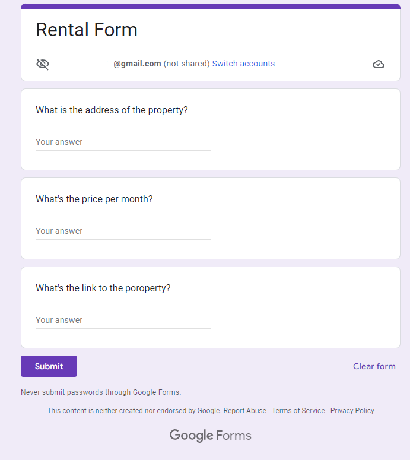
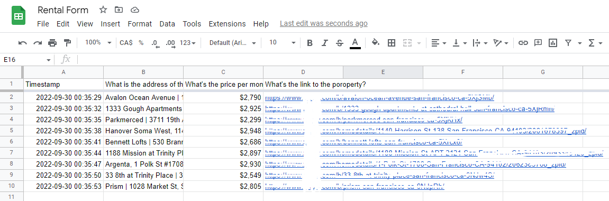

First, create a form with short answers on Google Docs.

Before using the program, export ```Environment Variables```.

```Environment Variables``` must be like:

```
DATA_URL = https://www.xxxxxxx.com/homedetails/xxx-Yonge-St
DATA_MP = https://www.xxxxxxx.com
CHROME_DRIVER_PATH = .../xxx/chromedriver.exe
FORM_URL = https://docs.google.com/forms/xxx/xxxx/...
```
Google Docs Form Img:



Google Docs Excel Img:



Warning : If there is 20+ post but the program returns only 9-11 outputs, it is caused by "lazy-loading".
